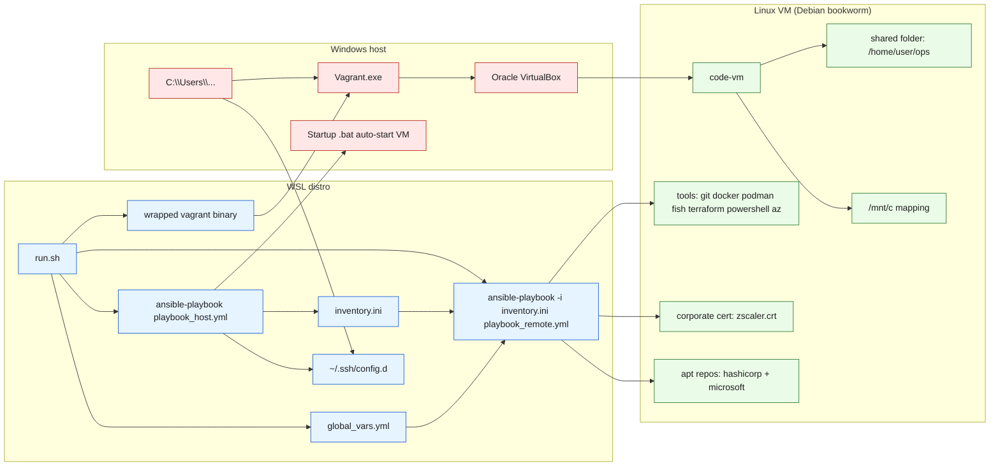

# setupmypc

Windows is lame but I have no choice but to use it, so... this repo aims at setting up a debian vagrant box to code from.

## prerequisites are

- WSL has to be set up [see dedicated file for that](./configure_wsl.md)
- vagrant and oracle vbox needs to be installed in windows

## then

- vagrant box (debian bookworm) is pulled
- vm is created with vars from [*global_vars.yml*](./global_vars.yml)
  - network is *vbox host only* (for some reason bridged network was a pain in the glass to setup)
- *ops* (working_dir) and *C:\\* (as */mnt/c*) folder is shared with vm
- ansible set evrything else up

## Stupid things windows (and corporate restraictions) make me do

In order to use ansible (and deploy all of the scripts at the same time) I need a linux machine...

- so it's WSL by default
- so it's a nightmare with networking because of corporate restrictions
- so it's a nightmare with folders and links and permissions
- so I had to wrap Vagrant.exe in WSL (/home/yves/.local/bin/vagrant) because of networking issues
- so wrapped apps runs in windows with windows path, **hence a global_vars file to not mess all of that up**

## Architecture (component view)

## todo
set vscode config (sync settings?)
install vscode on vm + x11
include role hardening server
